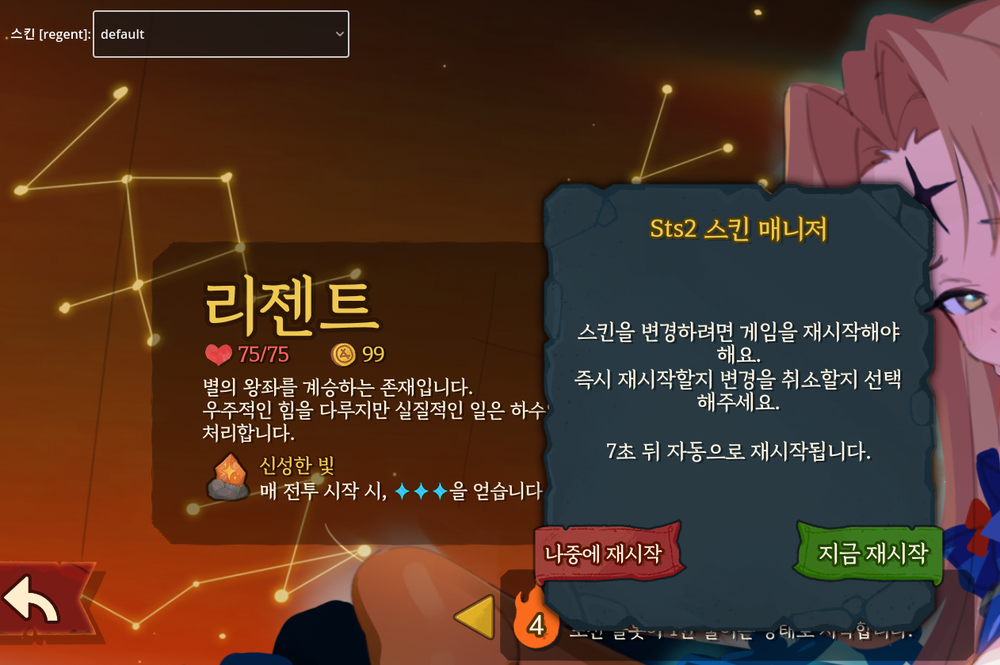
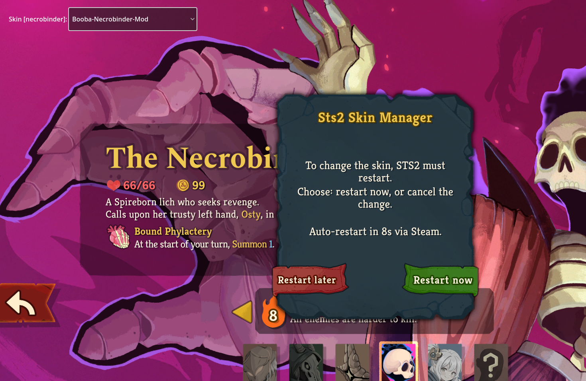

# Sts2SkinManager

같은 캐릭터의 스킨 모드가 여러 개 설치되어 있을 때, 어떤 모드를 적용할지 게임 내 드롭다운으로 선택할 수 있게 해주는 Slay the Spire 2 모드. 파일 이름 변경이나 폴더 정리 없이 캐릭터 선택 화면에서 바로 스킨을 전환합니다.

🇺🇸 [English README](README.md)




## 기능

- **자동 인식** — `<sts2>/mods/*/` 의 모든 `.pck` 를 스캔해서 `res://animations/characters/{캐릭터}/...` 경로를 포함한 것을 스킨 모드로 자동 감지. 별도 manifest 규약 없이 기존 스킨 모드 (Mesugaki_Regent, Booba-Necrobinder-Mod 등) 가 그대로 동작.
- **게임 내 UI** — 캐릭터 선택 화면에 드롭다운 오버레이 추가. 캐릭터 클릭 → 드롭다운에서 스킨 선택 → 끝.
- **카운트다운 모달** — STS2 native `NVerticalPopup` 스타일. "Restart now" 즉시 적용 / "Restart later" 보류.
- **Steam 자동 재실행** — 확인 시 매니저가 helper 를 spawn → STS2 종료 대기 → `steam://run/2868840` 으로 재실행. 새 세션에서 선택한 스킨 자동 적용.
- **취소 시 자동 revert** — "Restart later" 클릭 시 선택이 이전 값으로 자동 되돌아가서 동일 옵션을 다시 골라도 모달이 다시 떠요.
- **다국어 지원** — UI 문자열이 게임 현재 언어를 따라감. 지원: English, 한국어, 日本語, 简体中文/繁體中文, Deutsch, Français, Español (Castellano/Latam), Italiano, Português (BR/PT), Polski, Русский, ไทย, Türkçe. 미지원 언어는 English 폴백.
- **카드팩 관리 (v0.2.0+)** — 카드 아트 모드 (`.pck` 에 `card_art/MegaCrit.Sts2.Core.Models.Cards.*` 덮기 OR `card_portraits/` 자체 namespace) 자동 감지. Character Select 화면에 별도 패널 (체크박스 + ↑/↓ 화살표 + `1./2./3.` 우선순위 번호) 표시. 여러 팩 동시 활성 가능, 겹치는 카드는 **리스트 상단의 팩이 이김**. 패널은 접고 펼 수 있고 (▼/▶ 헤더), 긴 목록은 자동 스크롤. 토글/순서 변경 시 STS2 `settings.save` 갱신 + 캐릭터 스킨과 동일한 재시작 모달.

## 동작 방식

1. **부팅 가로채기**: `ProjectSettings.LoadResourcePack` 에 Harmony patch 를 걸어 인식된 skin variant `.pck` 의 자동 mount 를 차단. 기본 상태 → variant 아무것도 mount 안됨 → base 게임 스킨 표시.
2. **선택적 mount**: 매니저가 `skin_choices.json` 을 읽어 각 캐릭터의 active variant pck 를 직접 mount. 캐릭터 `SpineSprite` 가 instantiate 되기 전에 mount 되므로 scene 로드 시 새 데이터가 사용됨.
3. **라이브 UI**: 드롭다운에서 선택을 바꾸면 매니저가 `skin_choices.json` 을 갱신하고, 10초 카운트다운 모달을 띄움. 확인 시 STS2 재실행.

## 설치

1. 최신 release 다운로드 (또는 소스에서 빌드 — 아래 참조).
2. `Sts2SkinManager` 폴더를 `<Slay the Spire 2 설치 경로>/mods/` 에 복사.
3. mod 목록에서 `Sts2SkinManager` 가 **가장 먼저** 로드되어야 함. 모드 자체가 첫 부팅 시 load order 를 자동 재정렬하니까, self-bootstrap 적용을 위해 한 번 재시작 필요.

설치 후 폴더 구조:
```
<sts2>/mods/Sts2SkinManager/
  Sts2SkinManager.dll
  Sts2SkinManager.json
```

## 사용법

### 게임 내

1. STS2 실행, 캐릭터 선택 화면 진입.
2. 좌상단에 **Skin [<캐릭터>]:** 드롭다운이 보임.
3. 캐릭터 클릭 (예: Regent). 드롭다운에 해당 캐릭터의 variant 들 (`default`, `Mesugaki` 등) 표시.
4. 드롭다운 열어서 원하는 variant 선택.
5. 모달 등장: "Skin selection changed. Auto-restart in 10 seconds via Steam."
6. **Restart now** 클릭 → 즉시 적용, **Restart later** 클릭 → 선택 롤백.

### JSON 파일 직접 편집 (고급)

매니저는 선택 상태를 `<user_data>/SlayTheSpire2/Sts2SkinManager/skin_choices.json` 에 저장. 직접 편집하면 file watcher 가 1초 이내 반응해서 같은 확인 모달 표시.

```json
{
  "regent": {
    "active": "Mesugaki",
    "available_variants": ["default", "Mesugaki"]
  },
  "necrobinder": {
    "active": "default",
    "available_variants": ["default", "Booba-Necrobinder-Mod"]
  }
}
```

`active` 를 `"default"` 로 설정하면 모든 variant 비활성화 + 게임 기본 캐릭터 표시.

## 제약 사항

- **시각 변경에 재시작 필요.** STS2 의 캐릭터 spine actor 가 런타임 데이터 교체를 지원하지 않음 — 세 가지 접근법 (`set_skeleton_data_res`, detach/reattach, 노드 완전 재생성) 을 시도했으나 모두 같은 벽에 부딪힘 (시각 미반영 OR 주변 UI 가 깨진 reference 로 망가짐). Steam 을 통한 ~5-10초 자동 재시작이 현실적 해법.
- **Variant 감지는 `.pck` 내부에 `res://animations/characters/{캐릭터}/...` 경로 포함을 요구.** 전투 스파인 없이 portraits/icons 만 덮는 스킨 모드는 미감지. `SkinModScanner.cs` 의 path pattern 확장으로 트리비얼하게 보강 가능.
- **첫 부팅 시 한 번 더 재시작 필요** — 처음 설치 시 Sts2SkinManager 가 다른 skin mod 보다 먼저 로드되도록 mod_list 를 재배치함. 다음 부팅에서 interception 이 완전 활성화됨.
- **암호화된 `.pck`** (`PACK_ENCRYPTED` flag) 는 파싱 불가. 현재 알려진 모드 중 해당 사항 없음.

## 모드 제작자를 위한 안내

호환성을 위한 별도 manifest 가 필요 없음. `.pck` 가 `res://animations/characters/{characterId}/...` 패턴을 포함하기만 하면 Sts2SkinManager 가 자동 인식.

드롭다운에 표시되는 variant 이름은 스킨 모드의 `.json` manifest 의 `id` 필드 값.

## 소스에서 빌드

.NET 9 SDK 와 로컬 STS2 설치 (build 가 `sts2.dll`, `0Harmony.dll` 을 참조할 수 있도록) 필요.

```bash
cd Sts2SkinManager
dotnet build -c Debug
```

빌드 후 자동으로 `<sts2>/mods/Sts2SkinManager/` 에 DLL + manifest 복사.

## 아키텍처

| 컴포넌트 | 역할 |
|---|---|
| `Discovery/SkinModScanner.cs` | `mods/` 디렉토리 순회, `.pck` 경로 파싱, 캐릭터 variant 감지 |
| `Discovery/PckPathReader.cs` | `.pck` 바이너리에서 ASCII run 추출 (경로 감지용) |
| `Patches/LoadResourcePackPatch.cs` | `ProjectSettings.LoadResourcePack` Harmony prefix — managed pck 의 auto-mount 차단 |
| `Patches/CharacterSelectScreenPatches.cs` | `NCharacterSelectScreen._Ready` / `SelectCharacter` Harmony postfix — overlay 부착 |
| `Runtime/ManagedPckRegistry.cs` | managed/mounted pck 의 스레드 안전 상태 + manual mount bypass flag |
| `Runtime/RuntimeMountService.cs` | variant pck 의 수동 mount (`ProjectSettings.LoadResourcePack` 직접 호출) |
| `Runtime/LoadOrderEnforcer.cs` | Sts2SkinManager 가 `mod_list[0]` 에 오도록 in-memory + 파일 재작성 |
| `Runtime/SkinSelectorOverlay.cs` | 게임 내 `OptionButton` 드롭다운 UI |
| `Runtime/ChoicesFileWatcher.cs` | `skin_choices.json` 의 `FileSystemWatcher` + cancel 시 revert 로직 |
| `Runtime/RestartCountdownModal.cs` | STS2 native `NVerticalPopup` 카운트다운 + Yes/No 콜백 |
| `Runtime/RestartHelper.cs` | STS2 종료 대기 후 `steam://run/2868840` 호출하는 `.bat` helper spawn |
| `Config/SkinChoicesConfig.cs` | `skin_choices.json` 읽기/쓰기 |
| `Config/Sts2SettingsWriter.cs` | load-order 강제를 위한 STS2 `settings.save` 읽기/쓰기 |

## 라이선스

MIT.

## 감사

- [Mesugaki_Regent](https://example) (Seic_Oh & Dodobird), Booba-Necrobinder-Mod 로 테스트.
- [STS2 modding](https://www.megacrit.com/) 인프라와 [HarmonyX](https://github.com/BepInEx/HarmonyX) 위에 구축.
