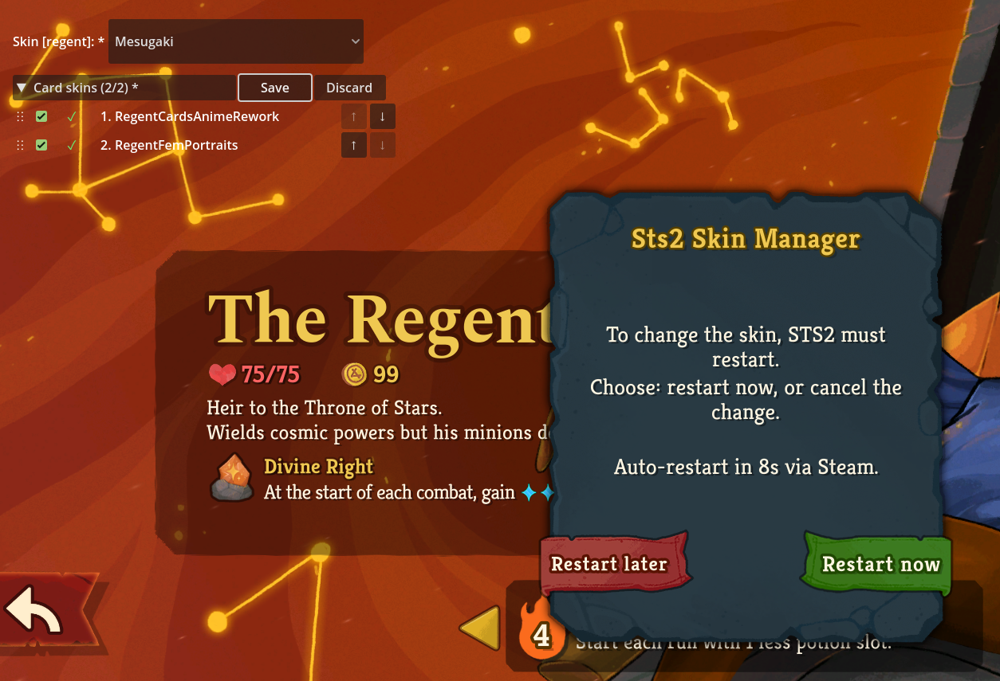

# Sts2SkinManager

설치된 **캐릭터 스킨 모드** 와 **카드 스킨 모드** (카드 초상화/아트) 를 캐릭터 선택 화면의 단일 패널에서 함께 관리하는 Slay the Spire 2 모드.

🇺🇸 [English README](README.md)

## 기능

- **자동 인식** — `<sts2>/mods/*/` 의 `.pck` 를 스캔해 아래 두 종류 모드를 자동 감지:
  - **캐릭터 스킨 모드** — `.pck` 안에 `res://animations/characters/{캐릭터}/...` 경로 포함
  - **카드 스킨 모드** — `.pck` 가 `card_art/...` 를 덮거나 `card_portraits/` 를 포함
- 캐릭터 선택 화면 게임 내 UI:
  - **캐릭터 스킨 드롭다운** — 캐릭터별 활성 variant 선택
  - **카드 스킨 패널** — 체크박스 토글, 우선순위 재정렬 (상단이 이김), 드래그앤드롭 또는 ↑/↓ 화살표
- **통합 저장 / 되돌리기** — 두 패널이 같은 Save 버튼을 공유. 모든 변경을 모은 뒤 한 번의 Save → 한 번의 재시작.
- **Steam 자동 재실행** — 확인 시 Steam 으로 STS2 재실행 (~5-10초). 취소 시 변경은 다음 부팅까지 대기 (Discard 로 완전 되돌리기).
- **다국어 UI** — 게임 현재 언어를 따라감. 16개 언어 지원, 미지원 언어는 English 폴백.

## 동작 원리

`ProjectSettings.LoadResourcePack` Harmony patch 가 모드 부팅을 가로챔. 매니저가 `skin_choices.json` 을 읽어 캐릭터 actor instantiate 전에 variant 를 mount 하고, 카드 스킨 활성/순서 상태를 STS2 `settings.save` 에 기록.

선택을 변경하면 `skin_choices.json` 갱신 + 10초 카운트다운 모달 표시. 확인 시 자동 재시작, 취소 시 변경은 대기 상태 유지. Discard 는 부팅 시점 상태로 모든 것을 복원.

## 설치

1. 최신 release zip 다운로드.
2. `Sts2SkinManager` 폴더를 `<Slay the Spire 2 설치 경로>/mods/` 에 복사.
3. 첫 부팅은 self-bootstrap (mod load order 재정렬) 1회 발생. 한 번 더 재시작하면 완전 활성화.

## 사용법

STS2 실행 → 캐릭터 선택 화면.

- **좌상단**: `Skin [<캐릭터>]:` 드롭다운. 캐릭터 클릭 → variant 선택.
- **드롭다운 아래**: `카드 스킨 (N/M)` 패널. 체크박스, 순서 번호, ↑/↓, 드래그 핸들. 토글하거나 화살표/드래그앤드롭으로 순서 변경.
- 원하는 변경을 모두 한 뒤 **Save** 클릭 → 재시작 모달 → **지금 재시작** 또는 **나중에 재시작** (변경은 다음 부팅까지 대기).
- **Discard** 는 모든 변경을 부팅 시점 상태로 복원.

`skin_choices.json` 위치: `<user_data>/SlayTheSpire2/Sts2SkinManager/`. 파일 직접 편집 시 file watcher 가 감지해 동일 모달 표시.

## 제약 사항

- **재시작 필요.** STS2 의 캐릭터 spine actor 가 runtime 데이터 교체 미지원 → Steam 을 통한 자동 재시작이 현실적 해법.
- 캐릭터 감지는 `res://animations/characters/{캐릭터}/...` 경로 기반. 카드 감지는 `card_art/...` 또는 `/card_portraits/` 기반. 아이콘만 덮는 모드는 미감지.
- 첫 설치 시 추가 재시작 1회 필요 (load-order self-bootstrap).
- 암호화된 `.pck` 는 미지원.

## 라이선스

MIT.
